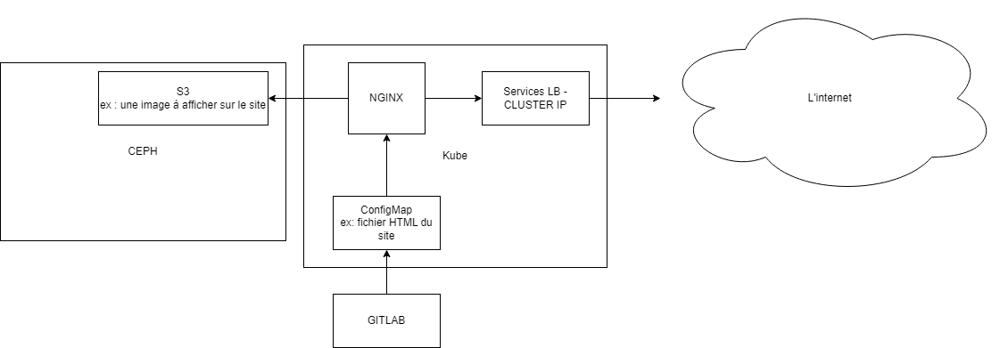
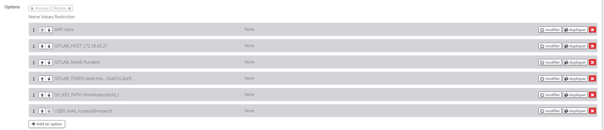
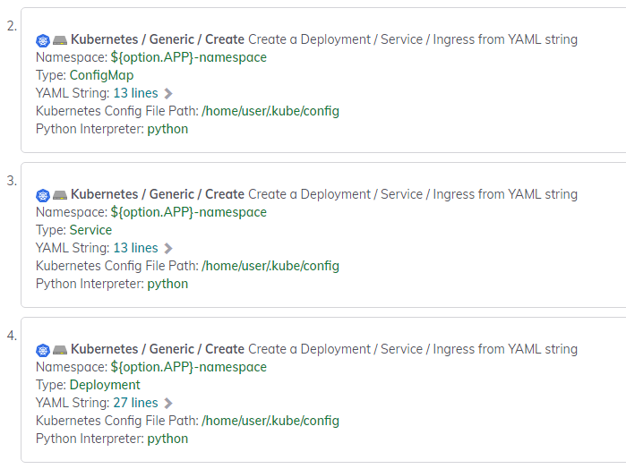
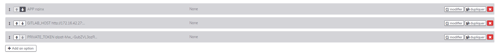

# Rundeck

Sur la partie Rundeck, 2 traitements seront a crée :

*La création d'un déploiement d'applications web en 2 parties:*
- Création d'un déploiement Kubernetes avec namespace dédié
- Création d'un projet dans GitLab

*La suppresion d'un déploiement d'applications web*
- Purge complète des ressources créer dans Kubernetes
- Suppression du projet dans Gitlab

Chaque traitement auront été écrit sur du bash, avec des fichiers yaml

Voici un schéma simple afin de visualiser la communication entre chacune des technologies :


# Procédure de création projet

Afin de prendre en compte la diversité des applications web, j'ai dynamisé le traitement Rundeck avec des options:


Et nous commençons par créer un namespace dédié à l'application que nous souhaitons créer:

```bash
kubectl --kubeconfig /home/user/.kube/config create namespace "${option.APP}-namespace"
```

L'étape suivante dans le workflow est la création du configmap.yml, service.yml et déployment.yml.
Grâce à un plugin, nous avons ces étapes spécifiques à kubernetes, qui applique automatiquement les fichiers crée.
Vous trouverez les scripts [ici](CreateKube).



Une fois le déploiement effectué, nous devons crée un projet et je rajoute le configmap dans le repository. Voici le script [ici](CreateKube/CreateProjectGit.sh).

# Procédure de suppression projet

Dans le cadre de la suppression de projet, j'ai crée 2 script :
1. Pour supprimer toutes les ressources dans le namespace de l'application demandée, ensuite le namespace en question.
2. Pour chercher le projet portant le nom de l'application demandé dans GitLab pour le supprimer ensuite.

Vous trouverez les script [ici](DeleteKube), avec toujours des options pour dynamiser.

